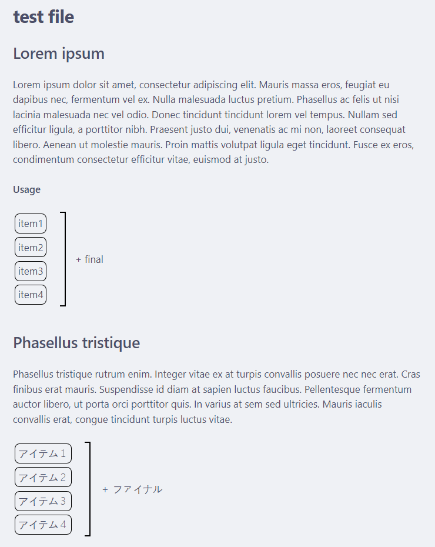

# convert-usage

## Obsidian snippet

For my Japanese Grammar (JPG) project, I have created a style for explanation on the usage of certain grammar points. There is no simple way to make it in Markdown, so I tried to make it with the least amount of HTML possible. You can find it in `examples/sample.md`. However, for it to work, you have to import a custom [CSS snippet](https://help.obsidian.md/Extending+Obsidian/CSS+snippets) to Obsidian, which is located in `obsidian-snippet/usage.css`. But using it, you will have this kind of result:

## convert-usage.py

In my Quartz rendering of my markdown data, I want this kind of data to be in a callout. However, it is not possible to combine HTML and Markdown in Obsidian. For that purpose, this script encapsulates it directly in HTML. To make it both compatible in Obsidian and Quartz, and to be still easy to write, it's done with this python script. This is probably super specific and will not be of use for anybody except me!

## Usage

Usage: `python3 convert-usage.py [root folder]`

Note: Please be careful, this software applies modifications recursively!